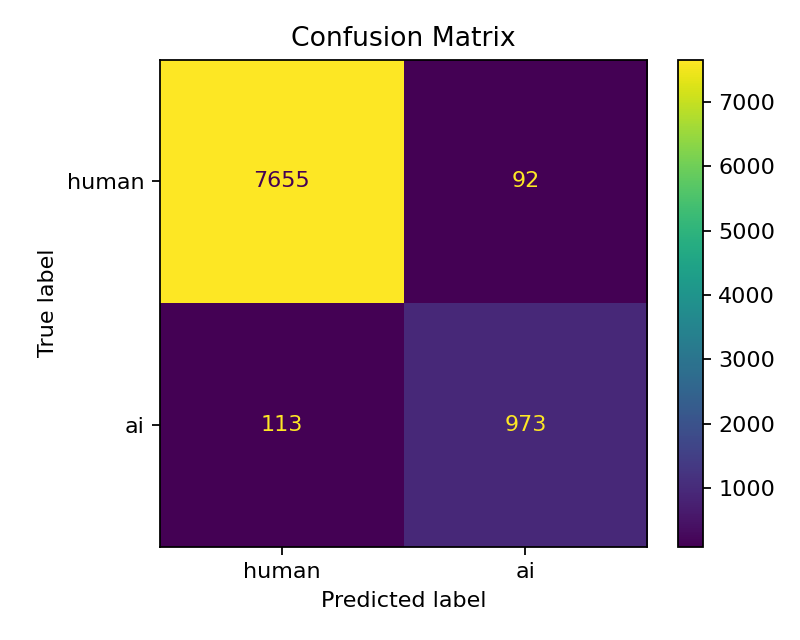

# RedNoteC — Text-Only Detection of AI-Generated RedNote Posts

A reproducible comparison of a lightweight lexical baseline and a Chinese
transformer encoder on binary AI-vs-human classification of Chinese
RedNote/Xiaohongshu (小红书) posts, using the
[RedNote-Vibe](https://github.com/ydli-ai/RedNote-Vibe) corpus.

**Research question:** for detecting AI-generated RedNote posts from title and
content alone, does a contextual transformer provide a meaningful advantage over
a character n-gram TF-IDF baseline?

**Answer:** yes, but the advantage is in recall and ranking quality, not raw
accuracy. The transformer cuts missed AI posts from 113 to 30 (AI recall 0.8959
→ 0.9724) at the cost of 30 extra human false positives, for a ~7× longer
training run.

---

## Results

Held-out test split, threshold 0.5:

| Model | Accuracy | Macro-F1 | AUROC | AUPRC |
| --- | --- | --- | --- | --- |
| Majority class | 0.8771 | 0.4672 | 0.5000 | 0.1229 |
| TF-IDF + LogReg (char n-gram) | 0.9768 | 0.9457 | 0.9899 | 0.9648 |
| chinese-roberta-wwm-ext | **0.9828** | **0.9615** | **0.9964** | **0.9882** |

Test set: 8,833 posts, 12.3% AI-generated.

The majority-class row is the analytic constant predictor (always "human"): its
AUROC is 0.5 by definition and its AUPRC equals the positive-class prevalence.
It is the number every other row has to beat, and it is why accuracy alone is
not a usable metric on this split — 87.7% accuracy is available for free.

### Error profile

The aggregate table understates the difference. The confusion matrices do not:

| Model | True human → pred AI | True AI → pred human | AI recall | AI precision | Train time |
| --- | --- | --- | --- | --- | --- |
| TF-IDF + LogReg | 92 | 113 | 0.8959 | 0.9136 | ~10 min (CPU) |
| chinese-roberta-wwm-ext | 122 | 30 | 0.9724 | 0.8964 | ~72 min (A100) |

This is a trade-off, not a uniform win. The transformer is the better choice for
recall-oriented detection; the baseline is stronger if human false positives are
expensive — flagging real users as bots has a real cost in a moderation setting.

### Where the baseline breaks down

Subgroup metrics (`outputs/reports/*/subgroup_metrics_*.csv`) show *where* the
extra capacity pays for itself:

- **Domain.** 学习 (study/education) is the weakest domain for both models, but the
  gap is widest there: TF-IDF AI recall 0.6944 vs. transformer 0.9444. Study
  posts are explanatory and structured, so human and AI writing converge on
  surface form.
- **Post length.** TF-IDF AI recall decays with length (0.9400 short → 0.8247
  long); the transformer holds (0.9794 / 0.9638 / 0.9691). In a long post a few
  AI-like phrases are diluted among ordinary ones, weakening character n-gram
  evidence.
- **Generator family.** GLM is hardest for both (TF-IDF 0.7177, transformer
  0.8871); Qwen is easiest for the transformer (1.0000). Note this is computed
  over AI rows in the same random split, so it is diagnostic — not evidence of
  unseen-generator generalization.

<p align="center">
  
  
</p>

---

## Design decision: text-only inputs

The single non-negotiable constraint of the project. Model input is built only
from the post itself:

```text
标题：{note_title}
正文：{note_content}
```

RedNote-Vibe also ships `domain`, `model_family`, `model`, `local_time`,
`likes`, `collections`, and `comments`. **None of these are model features.**
They are retained strictly for auditing, stratified splitting, subgroup
reporting, and error analysis.

The reason is leakage. `model_family` and `model` are populated for AI rows and
null for human rows — a classifier given that column would score near-perfectly
while learning nothing about AI-generated writing. Metadata artifacts of that
kind are unavailable at inference time in any real deployment, so admitting them
would make the headline number meaningless.

Label convention: `0 = human`, `1 = AI`.

Cleaning is deliberately conservative — whitespace normalization, line-ending
standardization, exact-duplicate removal. Emojis, hashtags, punctuation, slang,
and code-switching are **preserved**, because in Chinese social-media text those
carry the stylistic signal that separates human from AI writing. Aggressive
normalization would delete the evidence.

---

## Repository layout

```text
.
├── configs/                  # All hyperparameters, no magic numbers in code
│   ├── data.yaml             #   seed, split ratios, cleaning policy
│   └── models.yaml           #   tfidf_logreg + transformer_roberta configs
├── scripts/                  # CLI entry points (thin argparse wrappers)
│   ├── audit_data.py         #   raw-data audit, no side effects on splits
│   ├── prepare_data.py       #   clean → dedupe → stratified split
│   ├── train.py              #   train a registered model
│   ├── evaluate.py           #   score a saved model on the test split
│   ├── check_device.py       #   MPS/CUDA/CPU diagnostics
│   └── run_smoke_test.sh     #   end-to-end tiny-sample pipeline check
├── src/rednote_aigt/         # Installable package (src layout)
│   ├── data/                 #   load, clean, audit, split, prepare
│   ├── models/               #   tfidf, transformer, registry, io
│   ├── training/             #   training loop + training-curve plots
│   ├── evaluation/           #   metrics, subgroup analysis, plots
│   └── utils/                #   device selection, io, logging, progress
├── tests/                    # pytest unit + smoke tests
├── outputs/
│   ├── reports/              # Committed evidence: metrics, subgroups, errors
│   └── figures/              # Committed diagnostic plots
├── docs/
│   ├── report.pdf            # Full write-up (method, results, limitations)
│   └── model_choice.md       # Why these two models and these metrics
├── data/                     # Gitignored — download RedNote-Vibe locally
└── models/                   # Gitignored — regenerate with scripts/train.py
```

Models are resolved through a name → class registry
([src/rednote_aigt/models/registry.py](src/rednote_aigt/models/registry.py)), so
`--model tfidf_logreg` and `--model transformer_roberta` run through the same
training and evaluation path. Evaluation is shared, which is what makes the
results table an apples-to-apples comparison rather than two separate runs.

Large artifacts are not committed. Raw data, processed splits, trained weights,
and full prediction dumps are all gitignored; `outputs/` keeps the metrics,
subgroup tables, error samples, and figures that back the numbers above.

---

## Setup

```bash
python3 -m venv .venv
source .venv/bin/activate
pip install -e ".[dev]"
```

Requires Python ≥ 3.10. Runs on CUDA, Apple Silicon MPS, or CPU — the device
selector picks automatically:

```bash
python3 scripts/check_device.py
```

---

## Reproducing the results

### 1. Get the data

Download the supervised training files from
[RedNote-Vibe](https://github.com/ydli-ai/RedNote-Vibe/tree/main) into
`data/raw/`:

```text
data/raw/training_set_human.jsonl
data/raw/training_set_aigc.jsonl
```

`exploration_set.jsonl` is unlabeled post-LLM analysis data and is not used for
supervised training or metrics.

Verify you have the same files used here:

```bash
shasum -a 256 data/raw/training_set_human.jsonl data/raw/training_set_aigc.jsonl
```

```text
c737fe5d8b40dc21a3c61657e42e5359942a6abdf6837f31ad1dcef696eb1054  data/raw/training_set_human.jsonl
288d6ec75512301dd5accaa22205204ce626d13b61753bc3e7ff005061108659  data/raw/training_set_aigc.jsonl
```

### 2. Audit and prepare the splits

```bash
python3 scripts/audit_data.py   --config configs/data.yaml
python3 scripts/prepare_data.py --config configs/data.yaml --force
```

The audit writes `outputs/reports/data_audit.{json,md}` before any split exists,
which is what surfaced the metadata-leakage risk and the title-presence skew in
the first place.

Preparation loads 51,878 human and 7,254 AI rows, removes 250 within-label exact
duplicates, and produces a seed-42, 70/15/15, label+domain-stratified split:

| Split | Rows | Human | AI |
| --- | --- | --- | --- |
| Train | 41,217 | 36,140 | 5,077 |
| Validation | 8,832 | 7,741 | 1,091 |
| Test | 8,833 | 7,747 | 1,086 |

The splitter asserts that no exact duplicate text value crosses a split
boundary, so the held-out numbers are not inflated by leakage.

### 3. Train and evaluate

TF-IDF baseline:

```bash
python3 scripts/train.py    --model tfidf_logreg --config configs/models.yaml --force
python3 scripts/evaluate.py --model-dir models/tfidf_logreg --test-path data/processed/test.csv
```

Transformer:

```bash
python3 scripts/train.py    --model transformer_roberta --config configs/models.yaml --device auto --force
python3 scripts/evaluate.py --model-dir models/transformer_roberta --test-path data/processed/test.csv --device auto
```

Both write metrics, subgroup tables, error CSVs, and plots to
`outputs/reports/<model>/` and `outputs/figures/<model>/`.

### 4. Quick check without the full corpus

```bash
bash scripts/run_smoke_test.sh
```

Trains and evaluates both models on a tiny sample to verify the pipeline end to
end. Smoke-test metrics verify code paths only — they are not research results.

---

## Model configurations

| Model | Configuration |
| --- | --- |
| TF-IDF + LogReg | Character 2–5 grams, `min_df=2`, `max_df=0.95`, sublinear TF, 300k max features; class-weighted logistic regression, `liblinear`; 300,001 parameters |
| chinese-roberta-wwm-ext | `hfl/chinese-roberta-wwm-ext`, 12 layers / hidden 768 / 12 heads; max length 256, effective batch 8, lr 2e-5, 1 epoch, weight decay 0.01, warmup 0.06; 102.3M parameters; best model selected on validation macro-F1 |

Character n-grams are the right baseline for this corpus specifically because
they need no word segmenter — jieba's behavior on slang, emoji-laden, and
code-switched RedNote text is itself a confound. Full rationale for both model
choices and the metric set is in [docs/model_choice.md](docs/model_choice.md).

---

## Limitations

Stated plainly, because they bound what the results table means:

- **In-distribution only.** Train, validation, and test all come from one dataset
  construction process. The numbers are supervised in-distribution evidence, not
  proof of robustness to new generators, new prompting styles, or future posts.
- **No held-out-generator experiment.** Generator-family subgroup results are
  computed over the same random split, so they diagnose difficulty — they do not
  measure generalization to an unseen generator.
- **No ablations.** Title-only vs. content-only input, word-segmented TF-IDF,
  alternative checkpoints, and sequence-length sweeps were not run.
- **No qualitative error analysis.** False positives and negatives are exported
  (`outputs/reports/*/errors_*.csv`) but not manually coded, so it is not yet
  established whether long-post false positives reflect genuine AI signal or a
  proxy for polished writing style.
- **Single threshold.** Everything is reported at 0.5. A deployed detector would
  tune the threshold on validation against an explicit recall/precision target.

The intended use is decision support with human review, not automated
moderation. False positives here mean accusing a real person of being a bot.

---

## Report

The full write-up — method, experiments, subgroup analysis, and related work —
is in [docs/report.pdf](docs/report.pdf).

Authors: Xin Qian, Xubin Cai, David Edvin Welzien.
