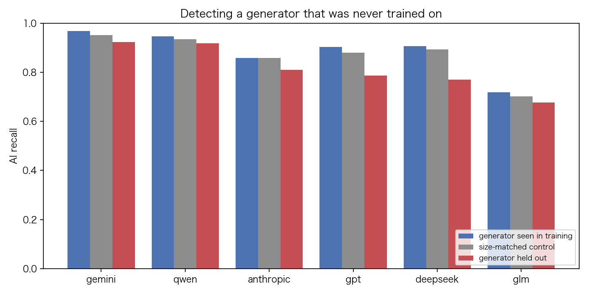

# RedNoteC — Text-Only Detection of AI-Generated RedNote Posts

Can a classifier tell an AI-written Xiaohongshu (小红书) post from a human one using nothing but the post itself? We put a character n-gram TF-IDF baseline against a Chinese RoBERTa encoder on 58,882 posts from [RedNote-Vibe](https://github.com/ydli-ai/RedNote-Vibe), then asked the question that decides whether any of it survives contact with the real world: what happens when the detector meets a generator nobody trained it on?

Three things came out of it.

1. The transformer wins, but not where the leaderboard says. Accuracy moves 0.9768 → 0.9828. The number that actually changes is missed AI posts: 113 drops to 30.
2. That gain is not free. Catching those 83 extra posts costs 30 more real users wrongly flagged as bots.
3. Both of those numbers flatter the models. Hold a generator out of training entirely and the baseline's recall falls on every one of the six families, by as much as 14 points. A size-matched control shows that 81% of the fall is the generator being unfamiliar, not the smaller training set.

---

## The headline comparison

Held-out test split of 8,833 posts, 12.3% AI-generated, threshold 0.5:

| Model                         | Accuracy   | Macro-F1   | AUROC      | AUPRC      |
| ----------------------------- | ---------- | ---------- | ---------- | ---------- |
| Majority class ("all human")  | 0.8771     | 0.4672     | 0.5000     | 0.1229     |
| TF-IDF + LogReg (char n-gram) | 0.9768     | 0.9457     | 0.9899     | 0.9648     |
| chinese-roberta-wwm-ext       | **0.9828** | **0.9615** | **0.9964** | **0.9882** |

Accuracy is nearly useless on this data. Answer "human" every time and you score 87.7% without reading a character. What separates the models is which mistakes they make:

| Model                   | Humans flagged as AI | AI posts missed | AI recall (95% CI)      |
| ----------------------- | -------------------- | --------------- | ----------------------- |
| TF-IDF + LogReg         | 92                   | 113             | 0.8959 [0.8764, 0.9127] |
| chinese-roberta-wwm-ext | 122                  | 30              | 0.9724 [0.9608, 0.9806] |

The recall intervals do not overlap, so the transformer's advantage is not sampling noise. Whether it is worth having depends on what a flag does. A human review queue can swallow 122 false positives. An automatic ban cannot. Those are 122 real people accused of being bots.

Both models trained on the same Apple Silicon machine in a single pass over the data: scikit-learn on CPU for the baseline, the MPS GPU backend for the encoder (`train_runtime` 4,339 s, about 72 minutes).

---

## Does it detect AI text, or does it detect these six models?

This is the part most detection papers leave out, and it is the part that decides whether a detector is worth deploying. Every number above comes from a random split, where each generator in the test set also appears in training. A model that has memorized how GPT phrases a skincare post scores exactly the same as a model that has learned what machine writing looks like. In-distribution accuracy cannot tell those two apart.

So we forced them apart. For each generator family, the baseline was retrained from scratch with that family deleted from training _and_ validation, then scored on the same test rows the original model saw: all 7,747 human posts plus that one family's posts. Nothing else changed, so the only difference between the first and last columns below is whether the model had ever read that generator's output.

| Generator held out | Test posts | Recall, generator seen | Size-matched control | Recall, generator unseen | Cost of the generator being new |
| ------------------ | ---------: | ---------------------: | -------------------: | -----------------------: | ------------------------------: |
| deepseek           |        244 |                 0.9057 |               0.8934 |               **0.7705** |                          −0.123 |
| gpt                |        249 |                 0.9036 |               0.8795 |               **0.7871** |                          −0.092 |
| anthropic          |        105 |                 0.8571 |               0.8571 |               **0.8095** |                          −0.048 |
| gemini             |        181 |                 0.9669 |               0.9503 |               **0.9227** |                          −0.028 |
| glm                |        124 |                 0.7177 |               0.7016 |               **0.6774** |                          −0.024 |
| qwen               |        183 |                 0.9454 |               0.9344 |               **0.9180** |                          −0.016 |

Across the six folds, missed AI posts climb from 113 to 198. Recall falls for every single family, and it falls furthest on DeepSeek and GPT, two of the three the model handled best when it had seen them.

The middle column is there because the first version of this result was not trustworthy. Removing a family also removes 10-24% of the AI training rows, and the two largest drops belonged to the two largest families, so "unseen generator is hard" and "less training data is hard" predicted the same table. The control separates them: it deletes the same number of AI rows at random and keeps the family in. Volume costs 0.013 recall on average. The generator being new costs 0.055. Four fifths of the damage is novelty.

One number refuses to fall with the others. AUROC across the held-out folds stays between 0.951 and 0.995, against 0.9899 in-distribution. The model still sorts unseen-generator posts above human ones almost as well as it ever did. What breaks is where 0.5 lands on that ranking. Scores for an unfamiliar generator shift down as a group and slide under a threshold that was calibrated on familiar ones. That is a friendlier failure than it first looks: it is a recalibration problem, not a representation problem, and a deployment that tunes its threshold per generation of models would recover much of the loss.

Anthropic is the cleanest illustration. Dropping 10% of AI training rows at random costs nothing at all (0.8571 either way), and dropping Claude's posts specifically costs 4.8 points.

<p align="center">
  
</p>

Per-fold metrics are in `outputs/reports/tfidf_logreg/generator_holdout/`, and the three-way decomposition is `decomposition.csv` in the same directory.

### Reading the fold tables

Read `recall_ai` when comparing folds. Precision and AUPRC are not comparable across folds. Each fold keeps all 7,747 human rows but only one family's AI rows, so the positive-class rate moves with the family. AUROC and the false-positive count stay comparable.

### Running the same test on the transformer

The experiment is model-agnostic; only the runtime changes:

```bash
python3 scripts/holdout_generator.py --model transformer_roberta --device auto
```

We did not run it. Each fold is a full fine-tune of `chinese-roberta-wwm-ext`, roughly 70 minutes per family on Apple Silicon, so about seven hours for the six-family sweep, against a few minutes per fold for the baseline. The script writes each fold's metrics as it finishes, so the sweep can be stopped and resumed a family at a time, and `--families glm qwen` runs just the extremes. Whether the encoder degrades the same way is the obvious next experiment, and the interesting possibility is that it degrades _less_: contextual representations may key on register and discourse rather than the character habits a specific model happens to have.

---

## Where the baseline breaks down

Slicing the test set shows the transformer's edge is concentrated exactly where surface statistics run out.

- **Study posts (学习)** are the hardest domain for both models and the widest gap between them: 0.6944 AI recall for TF-IDF against 0.9444. Explanatory, structured writing is where human and machine prose converge.
- **Long posts** break the baseline and not the encoder. TF-IDF slides from 0.9400 to 0.8247 across length thirds; the transformer holds at 0.9794 / 0.9638 / 0.9691. Spread a few machine-sounding phrases through a long post and character n-gram evidence gets diluted.
- **GLM is the hardest generator to catch** for both models (0.7177 vs. 0.8871).

<p align="center">
  
  
</p>

---

## Text-only inputs

Model input is the post and nothing else:

```text
标题：{note_title}
正文：{note_content}
```

RedNote-Vibe also ships `domain`, `model_family`, `model`, timestamps, and engagement counts. None are features. `model_family` and `model` are filled in for AI rows and empty for human rows, so a classifier handed either would score almost perfectly while learning nothing about writing, and none of these exist at inference time anyway. They are kept for auditing and the subgroup analysis only.

Cleaning stops at whitespace and exact duplicates. Emoji, hashtags, punctuation and code-switching all survive, because in Chinese social media that is where the style lives.

One artifact is worth naming: 14.29% of human posts have no title, against 0% of AI posts, so the `标题：` line is itself faint evidence of a machine author. It cannot inflate AI recall, since every AI post has a title, but it hands the models a slice of easy human posts.

---

## Reproduce

```bash
python3 -m venv .venv && source .venv/bin/activate
pip install -e ".[dev]"
python3 -m pytest
```

Download `training_set_human.jsonl` and `training_set_aigc.jsonl` from [RedNote-Vibe](https://github.com/ydli-ai/RedNote-Vibe) into `data/raw/`, then:

```bash
python3 scripts/prepare_data.py --config configs/data.yaml --force
python3 scripts/train.py    --model tfidf_logreg --force
python3 scripts/evaluate.py --model-dir models/tfidf_logreg
python3 scripts/holdout_generator.py --model tfidf_logreg
python3 scripts/holdout_generator.py --model tfidf_logreg --mode control
```

Use `--model transformer_roberta` for the encoder. Splits are seed 42, 70/15/15, stratified by label and domain. The splitter refuses to emit a split where any post's text lands on both sides of a boundary, and reports near-duplicates that differ only by punctuation or emoji. That is 4 rows in the whole corpus.

---

## Limitations

Everything here is one corpus, one language, one moment in time, and the honest next steps are narrow:

- **Run the generator holdout and its control on the transformer**, to find out whether contextual models transfer across generators or merely memorize them better. The baseline's ranking survived unfamiliar generators while its threshold did not; an encoder may not split the same way.
- **Tune the threshold against a stated cost.** Every number is reported at 0.5. A deployed detector would pick its operating point from an explicit budget for false accusations, not from a default.

---

## Dataset

[RedNote-Vibe](https://github.com/ydli-ai/RedNote-Vibe) — _A Dataset for Capturing Temporal Dynamics of AI-Generated Text in Social Media_ ([arXiv:2509.22055](https://arxiv.org/abs/2509.22055)).

## Authors

- [David Welzien](https://github.com/Apolloden)
- [Xin Qian](https://github.com/icymeow)
- [Xubin Cai](https://github.com/xubin0)
